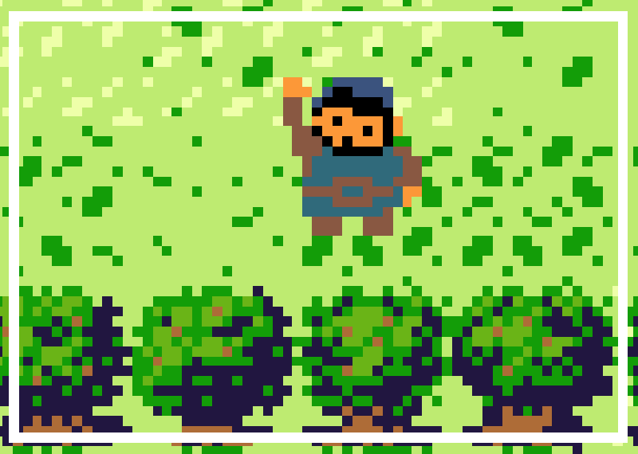
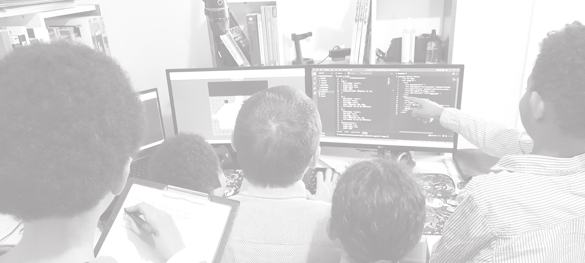

## ⚔️ The Legend Of Turgut ⚔️

### Présentation

"The Legend of Robin" est un jeu coder en 🗡️ HTML 🏹 CSS 🪓 JAVASCRIPT sans framework en utilisant Canvas.

Passionné de programmation, je partage avec vous ce projet ludique. Un projet jeu qui me permet de coder régulièrement. J'ai utilisé auparavant Phaser.js, Pygame et Unity mais je suis revenu a une version en JavaScript qui est le language utilisé dans le navigateur et donc accéssible à tous

### LE JEU

A voir ici : [THE LEGEND OF ROBIN](https://kduchevreuil.github.io/The-Legend-Of-Robin/)

    ⬆️---------------⬆️

### Qui est Robin ?

Robin des Bois est un personnage de fiction , héros légendaire et archétypal du Moyen Âge. Selon la légende telle qu'elle est répandue aujourd’hui, Robin des Bois était un brigand au grand cœur qui vivait caché dans la forêt de Sherwood et de Barnsdale. Habile braconnier, mais aussi défenseur avec ses nombreux compagnons des pauvres et des opprimés, il détroussait les riches au profit des pauvres ou rendait au peuple l'argent des impôts prélevés, selon les idéaux des auteurs.
 

### L'équipe de travail

 

### D'où vient ce projet ?

Ce jeu est un projet personnel et famillial car j'ai été aidé par mes enfants pour les graphismes, les peripeties et le nom du personnage principale. En plus des nombreux dessins, papercraft et autres activités manuelles, j'ai voulu leur faire découvrir le code et le développement web qu'ils comprennent mieux maintenant. J'ai aussi voulu leur faire découvrir la culture turque et l'histoire de ce pays.
 
En dehors de l'aspect ludique, ce projet me permet de mettre en pratique mes connaissances en JavaScript et de me perfectionner dans ce langage. Il y a eu beaucoup de changement et de version mais à chaque fois j'essaie d'améliorer le code et la qualité du jeu.

 

### Mes réseaux sociaux

